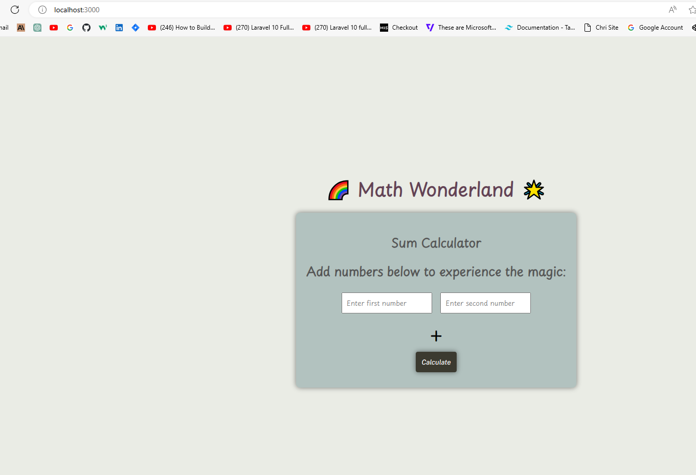
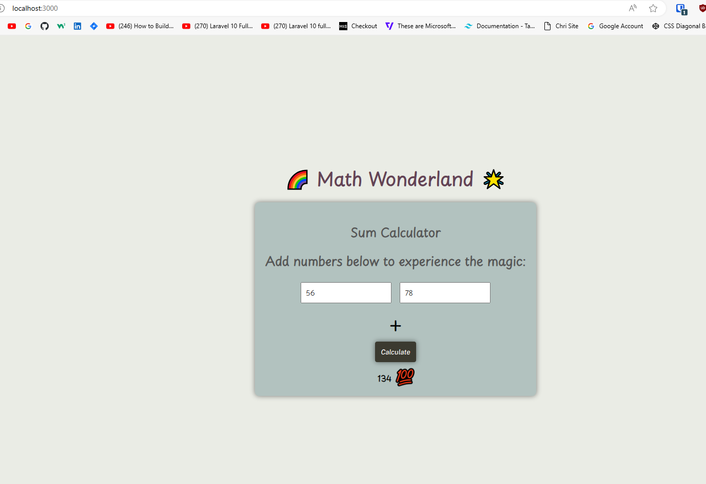

# Sum-Calculator-CFG
# Math Wonderland Sum Calculator

## Overview

Welcome to the Math Wonderland Sum Calculator! This application allows users to perform basic addition operations.

## Screenshots

### Homepage

### Result Display

## How to use

1. Enter numbers in the input fields.
2. Click the "Calculate" button.
3. Observe the magical result in the Math Wonderland!

## Features

- Custom "Math Wonderland" title.
- Animated emoji when a result is displayed.

## Demo

[Link to Demo Video](video/demo.mp4)

## Setup

1. Clone the repository.
2. Open `index.html` in your browser.

## Additional Notes

- Document any additional information, challenges faced, or decisions made during development.

