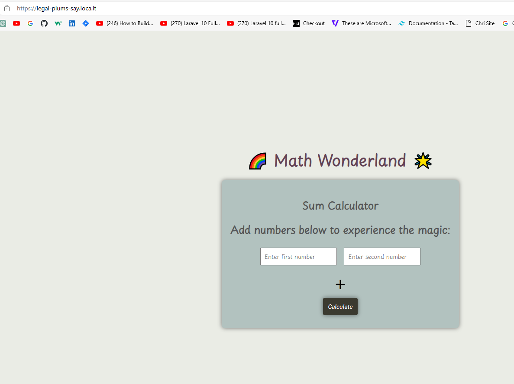
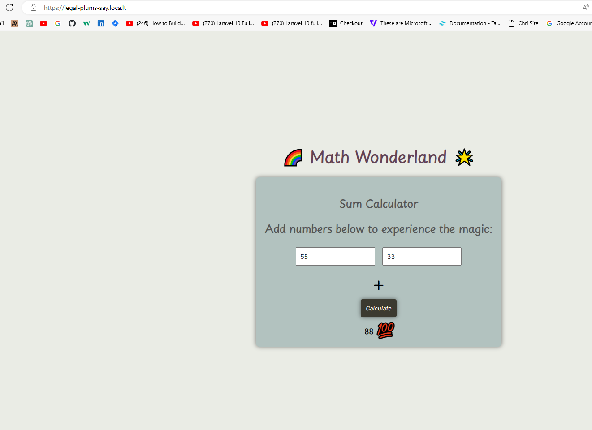

# Sum-Calculator-CFG
# Math Wonderland Sum Calculator

## Overview

Welcome to the Math Wonderland Sum Calculator! This application allows users to perform basic addition operations.

## Screenshots

### Homepage


### Result Display


## How to use

1. Enter numbers in the input fields.
2. Click the "Calculate" button.
3. Observe the magical result in the Math Wonderland!

## Features

- Custom "Math Wonderland" title.
- Animated emoji when a result is displayed.


## Video Demo

[![Watch the video]](https://youtu.be/B4mp6W_JHbM)

Click the image above to watch a video demonstration of the Sum Calculator website.


## Part 1: Website Setup

### Requirements
- Node.js installed

### Installation
1. Clone the repository:
   ```
   git clone https://github.com/movi1/Sum-Calculator-CFG.git
   cd Sum-Calculator-CFG
   ```
2. Install dependencies:
   ```
   npm install
   ```
## Running The Website Locally

1. Start the server:
   ```
   node app.js
 
   ```
2. Open your browser and navigate to [http://localhost:3000](http://localhost:3000) to view the Sum Calculator website.

## Part 2: Expose Website Publicly
### Requirement

1. Install localtunnel globally:
   ```
   npm install -g localtunnel

   ```

## Expose Website Publicly

2. Open a new terminal and run localtunnel:
   ```
   npx localtunnel --port 3000

   ```
3. Note the public URL generated by localtunnel.


